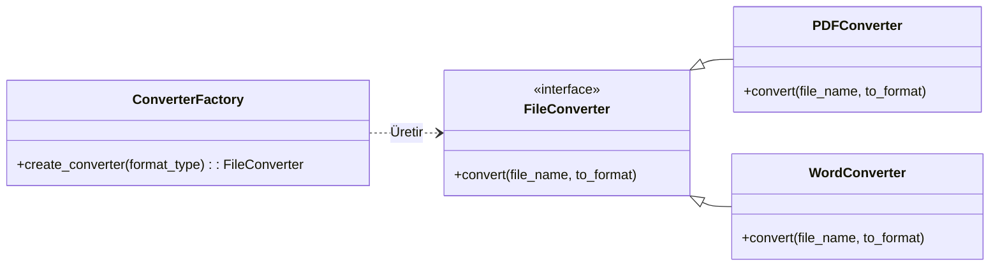
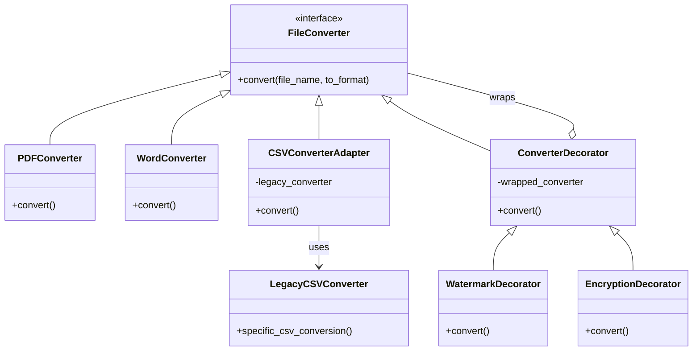

# Projede Kullanılan Tasarım Örüntüleri (Design Patterns)

## 1. Factory Method (Fabrika Metodu) - Creational
**Uygulandığı Faz:** Faz 1
**Uygulandığı Yer:** `src/converter.py` içindeki `ConverterFactory` sınıfı.

**Neden Kullanıldı?**
Başlangıç kodunda `FileConverter` sınıfı hem hangi nesnenin yaratılacağına karar veriyor hem de dönüştürme işini yapıyordu. Bu durum Tek Sorumluluk (SRP) prensibini bozuyordu. Nesne yaratma sorumluluğunu iş mantığından ayırmak için kullanıldı.

**Ne Kazandırdı?**
Açık/Kapalı Prensibi (OCP) sağlandı. Artık yeni bir format (örneğin JPEG) eklendiğinde, sadece yeni bir `JPEGConverter` sınıfı yazıp `ConverterFactory` içine tek bir satır eklememiz yeterli olacak. Sistemin geri kalan kodu (iş mantığı) bu değişiklikten hiç etkilenmeyecek.

### Önceki ve Sonraki Mimari (UML)

## 2. Adapter (Uyumlandırıcı) - Structural
**Uygulandığı Faz:** Faz 2
**Uygulandığı Yer:** `LegacyCSVConverter` ve `CSVConverterAdapter` sınıfları.

**Neden Kullanıldı?**
Sistemimize dışarıdan hazır bir CSV kütüphanesi (`LegacyCSVConverter`) dahil etmek istedik, ancak bu sınıfın metot yapısı bizim `FileConverter` arayüzümüze uymuyordu.

**Ne Kazandırdı?**
Eski/dış kütüphanenin kaynak koduna hiç dokunmadan, onu bir "Adaptör" sınıfı ile sarmalayarak kendi sistemimizle uyumlu çalışabilir hale getirdik.

## 3. Decorator (Dekoratör) - Structural
**Uygulandığı Faz:** Faz 2
**Uygulandığı Yer:** `ConverterDecorator`, `WatermarkDecorator` ve `EncryptionDecorator` sınıfları.

**Neden Kullanıldı?**
Dönüştürülen dosyalara "Filigran (Watermark) Ekleme" ve "Şifreleme" gibi yeni özellikler kazandırmak istedik. Bunu kalıtım (inheritance) ile yapsaydık (örn: `WatermarkedEncryptedPDFConverter` gibi) sınıf patlaması yaşayacaktık.

**Ne Kazandırdı?**
Orijinal `PDFConverter` sınıfını değiştirmeden, çalışma zamanında (runtime) dinamik olarak nesnelere yeni sorumluluklar ekleyebildik.

### Faz 2 Sonrası Güncel Mimari (UML)

## 4. Observer (Gözlemci) - Behavioral
**Uygulandığı Faz:** Faz 3
**Uygulandığı Yer:** `EventManager`, `ConsoleLogger`, `EmailNotifier` sınıfları.

**Neden Kullanıldı?** Dönüştürme işlemi bittiğinde loglama veya e-posta atma gibi işlemleri ana koda (`ConverterApplication`) gömmek istemedik.

**Ne Kazandırdı?** Sisteme yeni bir dinleyici (Örn: SMSNotifier) eklemek istediğimizde mevcut hiçbir koda dokunmadan sadece yeni bir sınıf oluşturmamız yeterli oldu (Açık/Kapalı Prensibi - OCP).

## 5. Strategy (Strateji) - Behavioral
**Uygulandığı Faz:** Faz 3
**Uygulandığı Yer:** `CompressionStrategy`, `ZipCompression`, `RarCompression` sınıfları.

**Neden Kullanıldı?** Farklı sıkıştırma algoritmalarını uzun `if-else` bloklarıyla yönetmek yerine çalışma zamanında (runtime) dinamik olarak değiştirebilmek istedik.

**Ne Kazandırdı?** Ana uygulama algoritma detaylarından bağımsız hale geldi. Sıkıştırma mantığı kolayca tak-çıkar yapılabilir bir modül oldu (OCP).